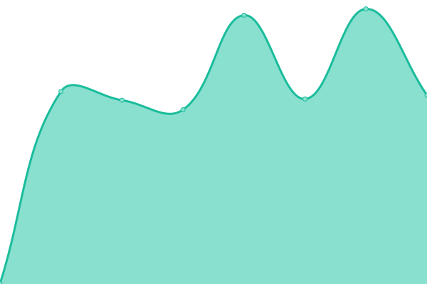

# [📈 Live Status](https://lehnux.net): <!--live status--> **🟧 Partial outage**

This repository contains the status page for [Lehnux Services](https://lehnux.net), powered by [Upptime](https://github.com/upptime/upptime).

<!--start: status pages-->
<!-- This summary is generated by Upptime (https://github.com/upptime/upptime) -->
<!-- Do not edit this manually, your changes will be overwritten -->
<!-- prettier-ignore -->
| URL | Status | History | Response Time | Uptime |
| --- | ------ | ------- | ------------- | ------ |
|  [Blog](https://lehnux.wordpress.com/) | 🟩 Up | [blog.yml](https://github.com/Lehnux/uptime/commits/HEAD/history/blog.yml) | 

 245ms
     
 | 

<a href="https://uptime.lehnux.net/history/blog">100.00%</a>
    

|  [Nextcloud Hosted](https://cloud.lehnux.net) | 🟩 Up | [nextcloud-hosted.yml](https://github.com/Lehnux/uptime/commits/HEAD/history/nextcloud-hosted.yml) | 

 1628ms
     
 | 

<a href="https://uptime.lehnux.net/history/nextcloud-hosted">99.46%</a>
    

|  [Blog Alias](https://blog.lehnux.net/) | 🟥 Down | [blog-alias.yml](https://github.com/Lehnux/uptime/commits/HEAD/history/blog-alias.yml) | 

 0ms
     
 | 

<a href="https://uptime.lehnux.net/history/blog-alias">100.00%</a>
    

|  [HA Proxy](https://proxy.lehnux.net/) | 🟥 Down | [ha-proxy.yml](https://github.com/Lehnux/uptime/commits/HEAD/history/ha-proxy.yml) | 

 498ms
     
 | 

<a href="https://uptime.lehnux.net/history/ha-proxy">100.00%</a>
    

|  [Sabnzb](https://sabnzb.lehnux.net/) | 🟥 Down | [sabnzb.yml](https://github.com/Lehnux/uptime/commits/HEAD/history/sabnzb.yml) | 

 445ms
     
 | 

<a href="https://uptime.lehnux.net/history/sabnzb">0.00%</a>
    

|  [Radarr](https://radarr.lehnux.net/) | 🟥 Down | [radarr.yml](https://github.com/Lehnux/uptime/commits/HEAD/history/radarr.yml) | 

 408ms
     
 | 

<a href="https://uptime.lehnux.net/history/radarr">0.00%</a>
    

|  [Plex Media Server](https://plex.lehnux.net/) | 🟥 Down | [plex-media-server.yml](https://github.com/Lehnux/uptime/commits/HEAD/history/plex-media-server.yml) | 

 0ms
     
 | 

<a href="https://uptime.lehnux.net/history/plex-media-server">100.00%</a>
    

|  [Sonarr](https://sonarr.lehnux.net/) | 🟥 Down | [sonarr.yml](https://github.com/Lehnux/uptime/commits/HEAD/history/sonarr.yml) | 

 374ms
     
 | 

<a href="https://uptime.lehnux.net/history/sonarr">0.00%</a>
    

|  [Router](https://rtr.lehnux.net/) | 🟥 Down | [router.yml](https://github.com/Lehnux/uptime/commits/HEAD/history/router.yml) | 

 0ms
     
 | 

<a href="https://uptime.lehnux.net/history/router">100.00%</a>
    

|  [VPN Service](https://vpn.lehnux.net) | 🟥 Down | [vpn-service.yml](https://github.com/Lehnux/uptime/commits/HEAD/history/vpn-service.yml) | 

 0ms
     
 | 

<a href="https://uptime.lehnux.net/history/vpn-service">100.00%</a>
    

|  [Nextcloud Internal](https://next.lehnux.net) | 🟥 Down | [nextcloud-internal.yml](https://github.com/Lehnux/uptime/commits/HEAD/history/nextcloud-internal.yml) | 

 0ms
     
 | 

<a href="https://uptime.lehnux.net/history/nextcloud-internal">100.00%</a>
    

<!--end: status pages-->

[**Visit the status website →**](https://uptime.lehnux.net)

## 📄 License

- Powered by: [Upptime](https://github.com/upptime/upptime)
- Code: [MIT](./LICENSE) © [Cédric Martinez](https://lehnux.net)
- Data in the `./history` directory: [Open Database License](https://opendatacommons.org/licenses/odbl/1-0/)
